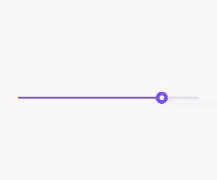

# This  flutter project uses canvas to create custom slider (ballon shape) with the physics like animation

i haven't spent much time on this project and the purpose of this project was to show how complex animation's  in canvas can be implemented  i have try to use global variables for the properties of the slider and the animation if you want you could fork this project and try to deploying it to a single widget and if you did  please crete a issue and notify me to add your repository link in description

